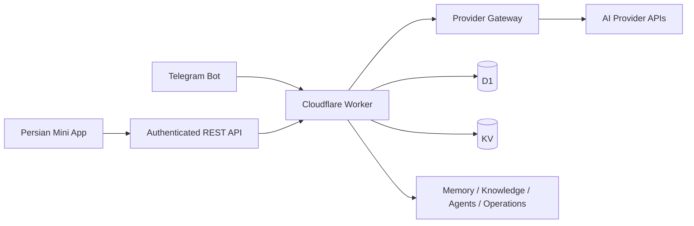

<div align="center">


**[English](README.md) · [فارسی](README.fa.md)**


</div>

<div dir="rtl">

# 🤖 PIMX AGENT BOT

**مدل‌های تو. حافظهٔ تو. فضای کار تو — داخل تلگرام.**

یک فضای شخصی هوش مصنوعی با ربات تلگرام، مینی‌اپ فارسی و گیت‌وی چندپروایدری روی Cloudflare Workers. پاسخ‌ها را زنده ببین، دانش و گفتگوهایت را مرتب کن، مدل‌ها را مقایسه کن و اطلاعاتت را به حساب تلگرام دیگری ببر.

[گیت‌هاب پروژه](https://github.com/MOHAMMADREZAABEDINPOOR/PIMX_AGENT_BOT) · [پروفایل PIMX](https://github.com/MOHAMMADREZAABEDINPOOR) · [نسخهٔ ثابت بنر](assets/readme/hero.png)

| در یک نگاه | جزئیات |
|:---|:---|
| 💬 تجربه | ربات تلگرام و مینی‌اپ فارسی واکنش‌گرا |
| 🔌 پروایدرها | فرمت‌های OpenAI-compatible، Gemini و Anthropic |
| 🧰 فناوری | JavaScript ES Modules · Cloudflare Workers · D1 · KV |
| 🎨 رابط | تم روشن و تیره، منوی موبایل و انتخاب‌گر قابل جستجوی مدل |
| 🌐 مستندات | [انگلیسی](README.md) · [فارسی](README.fa.md) |

[✨ قابلیت‌ها](#features) · [👀 پیش‌نمایش](#preview) · [🚀 شروع سریع](#getting-started) · [⚙️ تنظیمات](#configuration) · [🌍 استقرار](#deployment) · [🧪 تست‌ها](#checks)

---

## 🪐 یک ربات؛ یک فضای کاری متصل

در انیمیشن سه‌بعدی اختصاصی این پروژه، گوشی تلگرام و هواپیمای کاغذی به گره‌های هوش مصنوعی، API و حافظه متصل‌اند. این تصویر از معماری واقعی پروژه الهام گرفته است: هویت تلگرام، ارائه‌دهنده‌های انتخابی، پاسخ‌های زنده و داده‌های شخصی پایدار. این صحنه مخصوص همین ربات ساخته شده است.

| شروع | قدم بعدی |
|:---|:---|
| 👀 دیدن رابط | اجرای پیش‌نمایش ایزوله با دادهٔ نمونه و بدون کلید سرویس زنده |
| 🔌 اتصال مدل | ورود از تلگرام، افزودن ارائه‌دهنده و دریافت مدل‌های آن |
| 💬 ادامهٔ گفتگو | انتخاب مدل، دریافت پاسخ زنده و باز کردن گفتگوی ذخیره‌شده |
| 💾 انتقال کار | خروجی گرفتن از آرشیو و تأیید صریح بازیابی در حساب دیگر |

<a id="features"></a>

## ✨ فضای کاری که همراهت می‌ماند

| بخش | امکانات |
|:---|:---|
| 💬 گفتگو | دریافت پاسخ زنده، توقف تولید پاسخ و بازکردن چت‌های ذخیره‌شده |
| 🔌 مدیریت پروایدر | افزودن سرویس آماده یا سفارشی، مدیریت کلیدها، دریافت مدل‌ها و بررسی سلامت اتصال |
| 🤖 انتخاب مدل | جستجوی کاتالوگ، فیلتر قابلیت‌ها و انتخاب دقیق مدل هر پیام |
| 🧠 چند مدل همزمان | آرنای مقایسه، شورای هوش مصنوعی و آزمایشگاه پارامتریک |
| 📚 دانش شخصی | حافظه، اسناد، بازیابی دانش، قالب پرامپت و پروژه‌ها |
| 🤝 ایجنت و عملیات | تنظیم عامل‌ها، تاریخچهٔ اجرا، ابزارها، اتوماسیون، تأییدیه‌ها و مصرف |
| 💾 انتقال اطلاعات | دانلود آرشیو یا ارسال آن به تلگرام؛ بازیابی با تأیید در حساب مقصد |
| 🎨 مینی‌اپ | رابط راست‌به‌چپ، تم ماندگار، سایدبار دسکتاپ و تب‌های موبایل |
| ↩️ برگشت | دکمه در هدر و دکمهٔ بومی تلگرام؛ برگشت در تاریخچه و مسیر والد برای ورود مستقیم |

پروایدرهای آماده میان‌بر تنظیمات هستند. فهرست مینی‌اپ با سرویس‌هایی که خودت اضافه می‌کنی ساخته می‌شود؛ دسترسی به قابلیت‌ها به کلید، سرویس و مدل انتخابی بستگی دارد.

<a id="preview"></a>

## 👀 نگاهی به مینی‌اپ


<details>
<summary>جزئیات پروایدر در موبایل و دکمهٔ برگشت جدید</summary>


</details>

تصاویر از پیش‌نمایش محلی با حساب و پروایدر آزمایشی گرفته شده‌اند.

<details>
<summary>گالری بازطراحی کتابخانهٔ مدل‌ها، شورا و انتخاب‌گرها</summary>

| کتابخانهٔ مدل‌ها | جزئیات مدل | شورای هوش مصنوعی |
|:---:|:---:|:---:|
|  |  |  |

| آزمایشگاه | مقایسه | انتخاب ابزار |
|:---:|:---:|:---:|
|  |  |  |

انتخاب مدل، مدل پیش‌فرض و ابزار با جستجو، نام کامل، کنترل صفحه‌کلید و پنجرهٔ مناسب موبایل انجام می‌شود. کتابخانهٔ مدل‌ها دکمه‌های برچسب‌دار، منوی مدیریت گروهی و حالت بدون نتیجه دارد.

</details>

<a id="getting-started"></a>

## 🚀 شروع سریع

Node.js نسخهٔ 22.12 یا بالاتر و npm لازم است. برای اجرای واقعی، حساب Cloudflare، توکن ربات از [BotFather](https://t.me/BotFather) و کلید سرویس هوش مصنوعی موردنظرت را آماده کن.

<div dir="ltr">

```bash
git clone https://github.com/MOHAMMADREZAABEDINPOOR/PIMX_AGENT_BOT.git
cd PIMX_AGENT_BOT
npm ci
npm run preview
```

</div>

آدرس `http://127.0.0.1:8787/app` را باز کن. این پیش‌نمایش از حساب‌های آزمایشی امضاشده، ذخیره‌سازی در حافظه و پاسخ زندهٔ شبیه‌سازی‌شده استفاده می‌کند و به ربات یا پروایدر واقعی وصل نمی‌شود. کاربردش توسعه و بررسی رابط است.

<a id="configuration"></a>

## ⚙️ تنظیمات

| متغیر | کاربرد |
|:---|:---|
| `BOT_TOKEN` | توکن ضروری ربات؛ از طریق Cloudflare Secrets ثبت شود |
| `ADMIN_ID` | شناسهٔ عددی تلگرام برای عملیات مدیریتی |
| `SECRET_KEY` | مقدار اختیاری و ثابت برای رمزنگاری کلیدها؛ پیش‌فرض توکن ربات است |
| `TELEGRAM_WEBHOOK_SECRET` | سکرت اختیاری اعتبارسنجی وبهوک؛ در نبود آن از توکن ربات ساخته می‌شود |
| `MINIAPP_URL` | آدرس اختیاری مینی‌اپ؛ پیش‌فرض مسیر `/app` ورکر است |
| `GEMINI_API_KEYS_JSON`، `NVIDIA_KEYS_JSON` | آرایهٔ JSON اختیاری کلیدها برای مسیرهای قدیمی ربات |
| `OPENROUTER_API_KEY`، `MISTRAL_API_KEY` | کلیدهای اختیاری مسیرهای قدیمی ربات |
| `SEED_BUILTINS` | ورود خودکار پروایدرهای قدیمی به‌صورت پیش‌فرض خاموش است؛ `1` آن را فعال می‌کند |

Bindingهای میزبانی: **`DB`** برای D1 و **`BOT_KV`** برای KV. پلتفرم از D1 با پشتیبانی و انتقال از KV استفاده می‌کند؛ داده‌های مسیر قدیمی ربات نیز در KV قرار دارند. شناسه‌های `wrangler.toml` را با منابع خودت جایگزین کن.

مینی‌اپ امضای `initData` تلگرام را بررسی می‌کند، نشست می‌سازد و کلیدهای ذخیره‌شدهٔ پروایدر را با AES-GCM رمزنگاری می‌کند. برای بازیابی بکاپ رمزنگاری‌شدهٔ دیتابیس، مقدار رمزنگاری را ثابت نگه دار. فایل‌های محلی `.dev.vars` و `.env` وارد گیت نمی‌شوند.

<a id="deployment"></a>

## 🌍 استقرار روی Cloudflare

### دیپلوی خودکار از گیت‌هاب

[ورک‌فلو دیپلوی](.github/workflows/deploy.yml) با پوش و Pull Request روی `main`، بررسی سینتکس، تست‌های بک‌اند، تست مرورگر در موبایل و دسکتاپ و بیلد ورکر را اجرا می‌کند. بعد از موفقیت تست‌های پوش روی `main`، ورکر فعلی دیپلوی می‌شود. Pull Request فقط تست می‌شود؛ اگر کامیت جدیدتری روی `main` آمده باشد، دیپلوی کامیت قدیمی انجام نمی‌شود.

در **Settings → Secrets and variables → Actions** یک‌بار این دو مقدار را تنظیم کن:

| نوع | نام | مقدار |
|:---|:---|:---|
| Repository secret | `CLOUDFLARE_API_TOKEN` | توکن Cloudflare با قالب **Edit Cloudflare Workers** و دسترسی محدود به اکانت پروژه |
| Repository variable | `CLOUDFLARE_ACCOUNT_ID` | شناسهٔ اکانت Cloudflare |

متغیر شناسهٔ اکانت در این ریپازیتوری تنظیم شده است. فعال‌شدن دیپلوی خودکار به سکرت توکن نیاز دارد؛ ورود محلی Wrangler این دسترسی را به گیت‌هاب منتقل نمی‌کند. دیتابیس D1، فضای KV و سکرت‌های ورکر را یک‌بار آماده کن. دیپلوی متغیرها و سکرت‌های فعلی را نگه می‌دارد و وبهوک تلگرام یا دیتابیس را دوباره ایجاد نمی‌کند.

وضعیت اجراها و دیپلوی دستی در [GitHub Actions](https://github.com/MOHAMMADREZAABEDINPOOR/PIMX_AGENT_BOT/actions/workflows/deploy.yml) در دسترس است. اگر تست‌ها شکست بخورند، ورکر روی نسخهٔ قبلی باقی می‌ماند.

### راه‌اندازی اولیه و دیپلوی محلی

<div dir="ltr">

```bash
npm run login
npx wrangler kv namespace create BOT_KV
npx wrangler d1 create telegram-multi-ai-bots
```

</div>

شناسه‌های خروجی را در `wrangler.toml` قرار بده و نام Bindingها را `BOT_KV` و `DB` نگه دار. سپس جدول‌ها و سکرت‌ها را بساز:

<div dir="ltr">

```bash
npx wrangler d1 execute telegram-multi-ai-bots --remote --file tools/schema.sql
npx wrangler secret put BOT_TOKEN
npx wrangler secret put ADMIN_ID
npx wrangler secret put SECRET_KEY
npm run deploy
```

</div>

یک‌بار `https://<your-worker>.workers.dev/setup` را باز کن تا وبهوک، دکمهٔ مینی‌اپ و دستورات ربات ثبت شوند. `/start` بفرست، مینی‌اپ را باز کن و اولین پروایدر را اضافه کن. Cron هر دقیقه برای یادآورها و کارهای زمان‌بندی‌شده اجرا می‌شود.

دستور `npm run dev` در حالت **remote** ورنگلر اجرا می‌شود و ورود به Cloudflare لازم دارد. برای پیش‌نمایش مستقل رابط از `npm run preview` استفاده کن.

## 🎯 اولین استفاده

1. به ربات `/start` یا `/app` بفرست.
2. در **پروایدرها**، سرویس و کلید آن را اضافه کن و مدل‌ها را بگیر.
3. مدل را انتخاب کن و گفتگو را شروع کن.
4. وارد جزئیات پروایدر یا مدل شو و با **بازگشت** به صفحهٔ قبلی برگرد؛ فیلترهای مسیر حفظ می‌شوند.
5. در **پشتیبان و انتقال**، آرشیو حسابت را دانلود یا به تلگرام ارسال کن.

دستورات کاربردی: `/chats`، `/provider`، `/models`، `/doctor`، `/council`، `/backup` و `/restore`. دستور `/backupdb` مخصوص ادمین تنظیم‌شده است.

## 🧭 معماری و ساختار پروژه

<div dir="ltr">



</div>

| مسیر | مسئولیت |
|:---|:---|
| [`index.js`](index.js) | ورودی ورکر، ربات تلگرام، وبهوک و زمان‌بندی |
| [`src/miniapp/`](src/miniapp/) | رابط، استایل، صفحات و مسیریابی |
| [`src/api/`](src/api/) | احراز هویت تلگرام و REST API |
| [`src/gateway/`](src/gateway/) | پروایدرها، مدل‌ها، مسیریابی، استریم و عیب‌یابی |
| [`src/core/`](src/core/) | ذخیره‌سازی، سکرت‌ها، دسترسی و کانتکست |
| [`src/knowledge/`](src/knowledge/) | اسناد، حافظه و بازیابی دانش |
| [`src/agents/`](src/agents/) · [`src/ops/`](src/ops/) | ایجنت‌ها، ابزارها، اتوماسیون و آرشیوها |
| [`tools/`](tools/) | اسکیما، پیش‌نمایش و تست‌ها |
| [`assets/readme/`](assets/readme/) | بنر اختصاصی و تصاویر مینی‌اپ |

<a id="checks"></a>

## 🧪 دستورات و بررسی‌ها

| دستور | کاربرد |
|:---|:---|
| `npm run check` | بررسی سینتکس ورودی ورکر |
| `npm test` | تست وبهوک، استریم، مالکیت آرشیو و بازیابی |
| `npm run test:ui` | تست مرورگر برای تم، موبایل، انتخاب مدل و برگشت |
| `npm run preview` | پیش‌نمایش محلی با داده‌های آزمایشی |
| `npm run smoke` | بررسی API واقعی؛ تنظیمات لازم در [`tools/smoke.mjs`](tools/smoke.mjs) |
| `npm run logs` | مشاهدهٔ لاگ ورکر منتشرشده |

اگر Chromium نصب نیست، قبل از تست رابط `npx playwright install chromium` را اجرا کن.

## 🛠️ رفع مشکل

| مشکل | بررسی پیشنهادی |
|:---|:---|
| درخواست اتصال دوباره در مینی‌اپ | از داخل تلگرام دوباره بازش کن تا دادهٔ امضاشدهٔ تازه بگیرد |
| نبودن مدل‌ها | پروایدر، کلید و آدرس API را بررسی و کاتالوگ مدل‌ها را دریافت کن |
| جواب ندادن ربات | `BOT_TOKEN`، مسیر `/setup` و لاگ‌ها را بررسی کن |
| خطای D1 یا مصرف غیرمنتظرهٔ KV | Binding دیتابیس و اجرای `tools/schema.sql` را بررسی کن |
| ورود مستقیم بدون تاریخچه | برگشت به صفحهٔ والد و بعد خانه انجام می‌شود |

## 🤝 مشارکت

تغییرات را متمرکز نگه دار، تست مرتبط را اجرا کن و برای تغییر رابط تصویر بگذار. کلیدها، آرشیو کاربران و دیتابیس محلی را کامیت نکن. گزارش‌های پیاده‌سازی موجود، زمینهٔ تاریخی بیشتری دارند؛ این README ورودی‌ها و راه‌اندازی فعلی را توضیح می‌دهد.

## 📄 مجوز

مجوزی در سطح مخزن تعیین نشده است. برای شرایط استفاده و بازنشر با صاحب پروژه تماس بگیر.

---

<div align="center">

🤖 **PIMX AGENT BOT** · عضوی از خانوادهٔ **PIMX** · [English](README.md) · [فارسی](README.fa.md)

</div>

</div>
