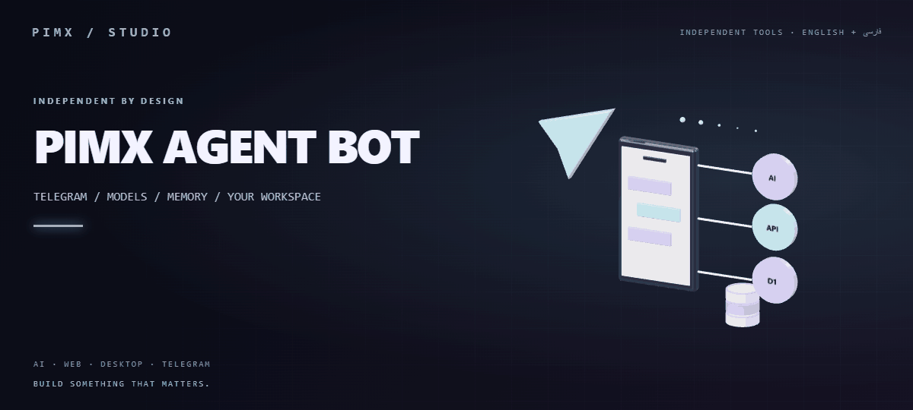
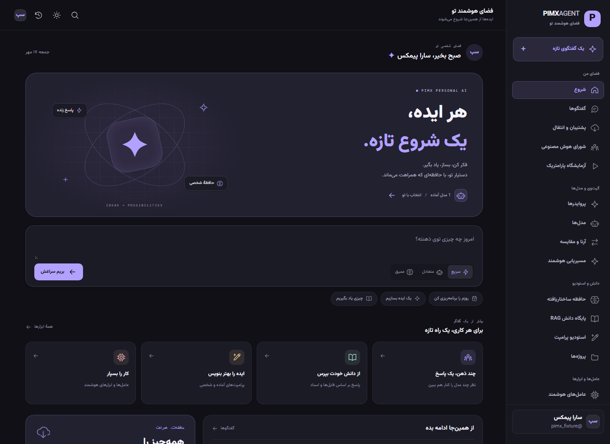
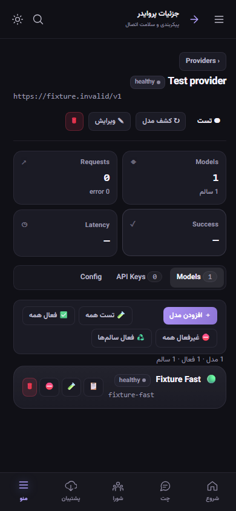
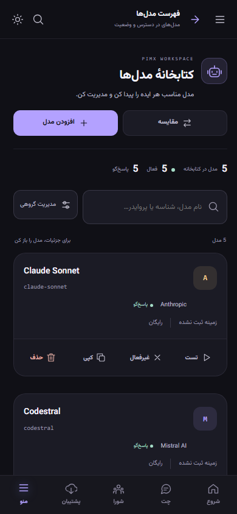
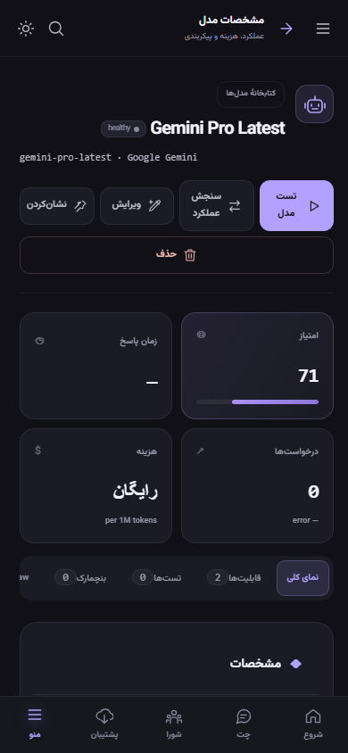
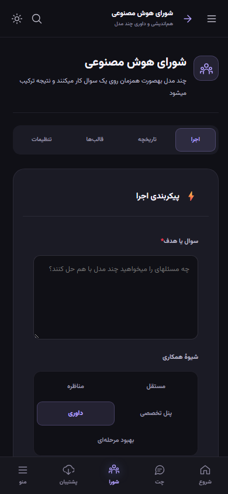
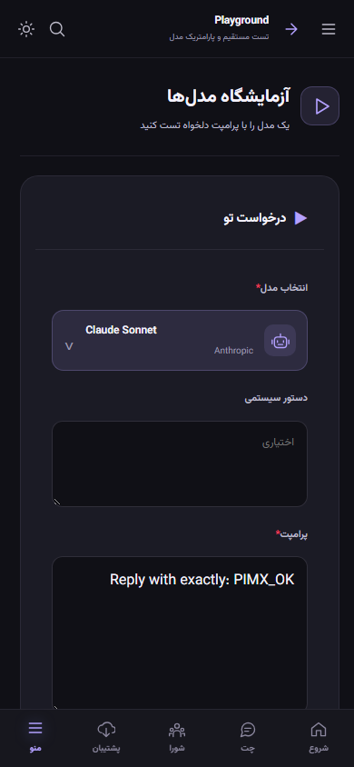
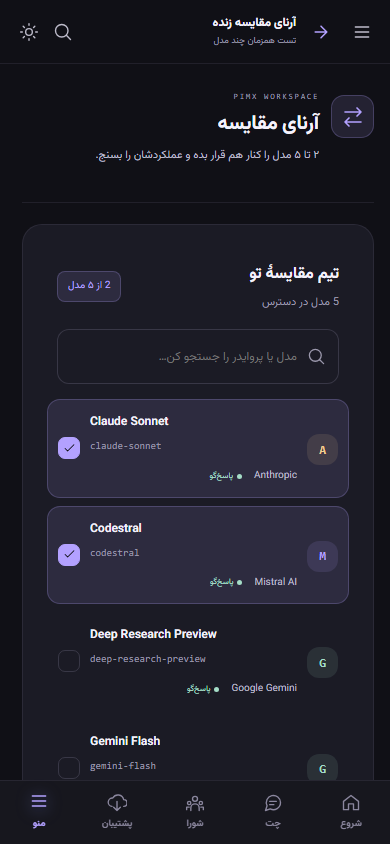
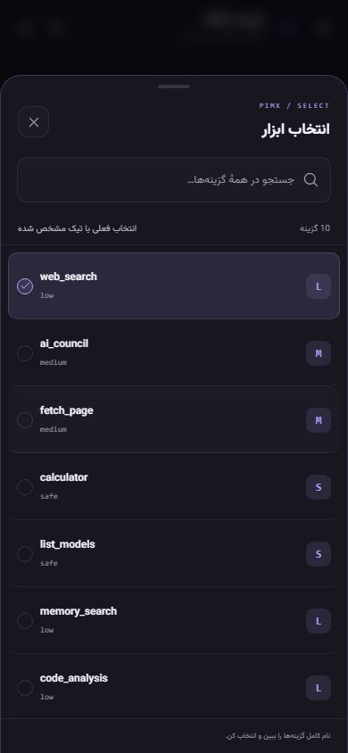
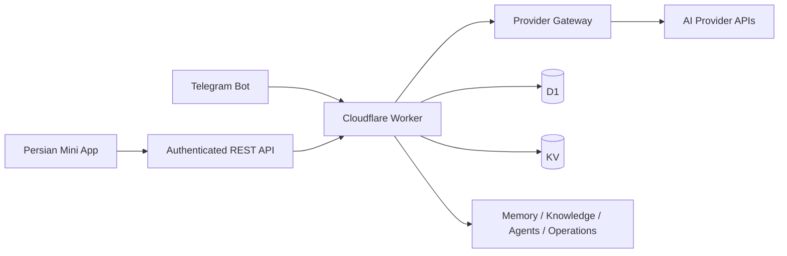

<div align="center">



**[English](README.md) · [فارسی](README.fa.md)**


</div>

# 🤖 PIMX AGENT BOT

**Your models. Your memory. Your workspace — inside Telegram.**

A personal AI workspace combining a Telegram bot, a bilingual Persian/English Mini App and a multi-provider gateway on Cloudflare Workers. Chat with live responses, organize your knowledge, compare models and carry your conversations to another Telegram account.

[GitHub](https://github.com/MOHAMMADREZAABEDINPOOR/PIMX_AGENT_BOT) · [PIMX / Profile](https://github.com/MOHAMMADREZAABEDINPOOR) · [Static artwork](assets/readme/hero.png)

| At a glance | Details |
|:---|:---|
| 💬 Experience | Telegram bot + responsive Persian Mini App |
| 🔌 Providers | OpenAI-compatible, Gemini and Anthropic API formats |
| 🧰 Built with | JavaScript ES modules · Cloudflare Workers · D1 · KV |
| 🎨 Interface | Dark/light themes, mobile navigation, searchable model picker |
| 🌐 Documentation | [English](README.md) · [فارسی](README.fa.md) |

[✨ Features](#features) · [👀 Preview](#preview) · [🚀 Getting started](#getting-started) · [⚙️ Configuration](#configuration) · [🌍 Deployment](#deployment) · [🧪 Checks](#checks)

---

## 🪐 One bot. A connected AI workspace.

The original 3D artwork links a Telegram phone and paper plane to AI, API and storage nodes. It represents the actual architecture: Telegram identity, your selected providers, streamed conversations and persistent personal data. Every project has its own scene; this one belongs to the bot.

| Start here | Next step |
|:---|:---|
| 👀 Try the interface | Run the isolated fixture preview without live provider credentials |
| 🔌 Connect a model | Open the Mini App through Telegram, add a provider and discover its models |
| 💬 Keep a conversation | Choose a model, stream a response and reopen the saved chat |
| 💾 Carry your work | Export your archive and explicitly confirm a restore into another account |

<a id="features"></a>

## ✨ A workspace that stays with you

| Area | What you can do |
|:---|:---|
| 💬 Conversations | Receive streamed responses, stop generation and reopen saved chats |
| 🔌 Provider control | Add a preset or custom provider, manage keys, discover models and inspect connection health |
| 🤖 Model discovery | Search the catalog, filter capabilities and select the exact model for your next message |
| 🧠 Multi-model workflows | Compare answers in the arena, run council discussions and experiment in the playground |
| 📚 Personal knowledge | Manage memory, documents, retrieval workflows, prompt templates and projects |
| 🤝 Agents & operations | Configure agents, inspect runs, manage tools, automations, approvals and usage |
| 💾 Portable data | Download an archive or send it to Telegram; confirm restoration into another account |
| Languages | [Persian + English](docs/LANGUAGES.md), saved account preferences, RTL/LTR layouts and a Mini App language toggle |
| 🎨 Mini App | persistent themes, desktop sidebar and mobile tabs |
| ↩️ Back navigation | Header and native Telegram BackButton, history-aware navigation and parent fallback for direct links |

Provider presets are configuration shortcuts. The Mini App registry starts with the providers you add; provider credentials and supported capabilities determine which features are available.

<a id="preview"></a>

## 👀 See the workspace



<details>
<summary>Mobile provider screen with the new back button</summary>



</details>

Screenshots use the isolated local preview with fictional account and provider data.

<details>
<summary>Explore the redesigned model library, council and selectors</summary>

| Model library | Model details | AI council |
|:---:|:---:|:---:|
|  |  |  |

| Playground | Comparison | Searchable tools |
|:---:|:---:|:---:|
|  |  |  |

Model, default-model and tool selectors support search, full names, keyboard navigation and mobile bottom sheets. The model library provides labeled actions, a grouped bulk menu and search empty states.

</details>

<a id="getting-started"></a>

## 🚀 Getting started

Use Node.js 22.12+ and npm. Production needs a Cloudflare account, a Telegram bot token from [BotFather](https://t.me/BotFather) and credentials for your chosen AI providers.

```bash
git clone https://github.com/MOHAMMADREZAABEDINPOOR/PIMX_AGENT_BOT.git
cd PIMX_AGENT_BOT
npm ci
npm run preview
```

Open `http://127.0.0.1:8787/app`. This preview uses signed fixture accounts, in-memory storage and simulated AI streaming without contacting your live bot or providers. It is a UI/testing environment.

<a id="configuration"></a>

## ⚙️ Configuration

| Setting | Purpose |
|:---|:---|
| `BOT_TOKEN` | Required Telegram credential; set through Cloudflare Secrets |
| `ADMIN_ID` | Numeric Telegram user ID for administrative operations |
| `SECRET_KEY` | Optional stable material for provider-key encryption; defaults to the bot token |
| `TELEGRAM_WEBHOOK_SECRET` | Optional webhook verification secret; derived from the bot token when omitted |
| `MINIAPP_URL` | Optional Mini App URL override; defaults to the Worker's `/app` URL |
| `GEMINI_API_KEYS_JSON`, `NVIDIA_KEYS_JSON` | Optional JSON key arrays for legacy bot provider paths |
| `OPENROUTER_API_KEY`, `MISTRAL_API_KEY` | Optional credentials for legacy bot provider paths |
| `SEED_BUILTINS` | Legacy provider import is disabled by default; `1` enables it |

Hosting bindings: **`DB`** (D1) and **`BOT_KV`** (KV). The platform uses D1 with KV fallback/migration; legacy bot data also uses KV. Replace resource IDs in `wrangler.toml` with your own.

The Mini App verifies Telegram's signed `initData`, creates a session and encrypts stored provider keys with AES-GCM. Keep encryption material stable when restoring encrypted database backups. Local `.dev.vars` and `.env` files are excluded from Git.

<a id="deployment"></a>

## 🌍 Deploy to Cloudflare

### Automatic deployment from GitHub

The [deployment workflow](.github/workflows/deploy.yml) runs syntax checks, backend tests, mobile/desktop browser tests and a Worker build on pushes and pull requests to `main`. A successful push to `main` then deploys the existing Worker. Pull requests only run checks; older commits are skipped if a newer commit has reached `main`.

Configure **Settings → Secrets and variables → Actions** once:

| Type | Name | Value |
|:---|:---|:---|
| Repository secret | `CLOUDFLARE_API_TOKEN` | Cloudflare **Edit Cloudflare Workers** API token restricted to the deployment account |
| Repository variable | `CLOUDFLARE_ACCOUNT_ID` | Your Cloudflare account ID |

The deployment account variable is already configured for this repository. Automatic deployment requires the API token secret; a local Wrangler login does not provide GitHub with that credential. Provision D1, KV and Worker secrets once before enabling deployments. Existing dashboard variables and Worker secrets are retained; the workflow does not reset the Telegram webhook or recreate the database.

Follow runs or trigger a manual deployment in [GitHub Actions](https://github.com/MOHAMMADREZAABEDINPOOR/PIMX_AGENT_BOT/actions/workflows/deploy.yml). If checks fail, the running Worker stays on its previous version.

### Initial setup / local deployment

```bash
npm run login
npx wrangler kv namespace create BOT_KV
npx wrangler d1 create telegram-multi-ai-bots
```

Copy the returned IDs into `wrangler.toml`, preserving the binding names `BOT_KV` and `DB`. Then initialize the database and add secrets:

```bash
npx wrangler d1 execute telegram-multi-ai-bots --remote --file tools/schema.sql
npx wrangler secret put BOT_TOKEN
npx wrangler secret put ADMIN_ID
# Provide stable encryption material of your own.
npx wrangler secret put SECRET_KEY
npm run deploy
```

Open `https://<your-worker>.workers.dev/setup` once to register the webhook, Mini App menu button and bot commands. Send `/start`, open the Mini App and add your first provider. The Cron trigger runs once per minute for reminders and scheduled work.

`npm run dev` uses Wrangler's **remote** development mode and requires Cloudflare authentication. Use `npm run preview` for isolated UI development.

## 🎯 Your first session

1. Send `/start` or `/app` to the bot.
2. In **Providers**, add a provider and its API key, then load its models.
3. Choose a model and begin a conversation.
4. Open provider or model details and use **Back** to return. Route filters survive history navigation.
5. Use **Backup & transfer** to download your account archive or send it to your Telegram chat.

Useful bot entry points: `/chats`, `/provider`, `/models`, `/doctor`, `/council`, `/backup` and `/restore`. `/backupdb` is reserved for the configured administrator.

## 🧭 Architecture



| Path | Role |
|:---|:---|
| [`index.js`](index.js) | Worker entry, Telegram bot, webhook and scheduled handlers |
| [`src/miniapp/`](src/miniapp/) | HTML, CSS, views, hash router and navigation |
| [`src/api/`](src/api/) | Telegram authentication and REST routes |
| [`src/gateway/`](src/gateway/) | Providers, models, routing, streaming and diagnostics |
| [`src/core/`](src/core/) | Storage, secrets, permissions and platform context |
| [`src/knowledge/`](src/knowledge/) | Documents, memory and retrieval helpers |
| [`src/agents/`](src/agents/) · [`src/ops/`](src/ops/) | Agent runtime, tools, automation and archives |
| [`tools/`](tools/) | Schema, fixture preview and automated checks |
| [`assets/readme/`](assets/readme/) | Original artwork and preview screenshots |

<a id="checks"></a>

## 🧪 Commands and checks

| Command | Purpose |
|:---|:---|
| `npm run check` | Check the Worker entry's syntax |
| `npm test` | Webhook, streaming, archive ownership and restore tests |
| `npm run test:ui` | Browser tests for themes, mobile, model selection and back navigation |
| `npm run preview` | Start the isolated fixture preview |
| `npm run smoke` | Live API checks; inspect [`tools/smoke.mjs`](tools/smoke.mjs) for configuration |
| `npm run logs` | Tail deployed Worker logs |

Install Chromium with `npx playwright install chromium` if needed before running UI tests.

## 🛠️ Troubleshooting

| Symptom | What to check |
|:---|:---|
| Mini App asks to reconnect | Reopen through Telegram to obtain fresh signed account data |
| No models are shown | Add a provider, check its key/base URL and load its model catalog |
| Bot does not answer | Check `BOT_TOKEN`, run `/setup` and inspect `npm run logs` |
| D1 errors or unexpected KV usage | Check the `DB` binding and apply `tools/schema.sql` |
| Direct link has no earlier history | Back returns to its parent screen and then home |

## 🤝 Contributing

Keep changes focused, run relevant checks and include screenshots for interface changes. Never commit credentials, user archives or local databases. Existing implementation reports provide additional historical context; this README describes current entry points.

## 📄 License

No repository-level license has been declared. Contact the owner for reuse terms.

---

<div align="center">

🤖 **PIMX AGENT BOT** · Part of **PIMX** · [English](README.md) · [فارسی](README.fa.md)

</div>
